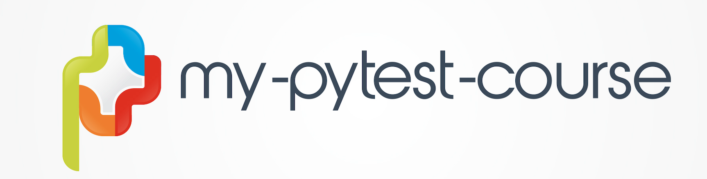

#  my-pytest-course

A repository for learning pytest by building a Django web application.

The application lists companies and indicates wether they are laying off/ hiring freeze or hiring.





## Environment Variables

To run this project, you will need to add the following environment variables to your .env file

`PYTHONPATH=/{YOUR_PATH_TO_PROJECT}/my-pytest-course/:/{YOUR_PATH_TO_PROJECT}/my-pytest-course/api/coronavstech`

`DJANGO_SETTING_MODULE=api.coronavstech.coronavstech.settings`


## Run Locally

Clone the project

```bash
  git clone https://bitbucket.org/e-marco/my-pytest-course/src/master/
```

Go to the project directory

```bash
  cd my-pytest-course
```

Install dependencies

```bash
  pipenv install
```

Start the Django server

```bash
  pipenv run api/coronavstech/manage.py runserver
```


## Running Tests

To run tests, run the following command

```bash
  pipenv run pytest .
```


## 🔗 Links
[](https://www.udemy.com/user/eden-marco/)
[](https://www.linkedin.com/in/eden-marco/)
[](https://twitter.com/EdenEmarco177)

